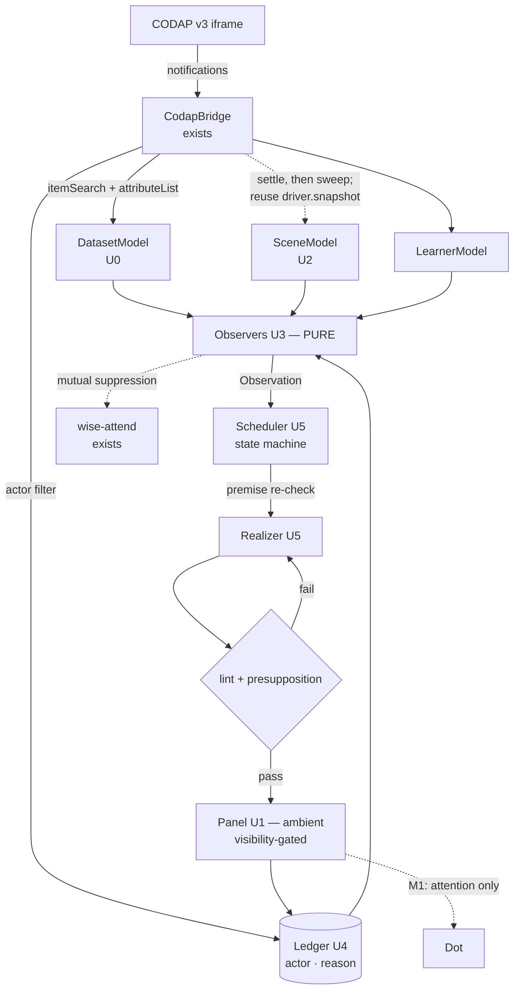

# feat: Wonderings — ambient inquiry prompts over a live CODAP document

**This document governs.** `docs/GOAL-WONDERINGS-U0-U6.md` is the short form for
starting work; where the two differ, this document wins. The design that
preceded both is `docs/WONDERINGS.md`, which is left unedited and carries a
header listing the claims this plan corrects.

## Overview

A panel anchored beside CODAP's Undo control shows a small number of short,
italic, rhetorical questions — *wonderings* — computed from the student's actual
dataset and current on-screen configuration. They fade in as scenarios emerge
and fade out when stale. They are ambient, attributed to no one, so the axolotl
character ("Dot") remains wordless and `docs/CHARACTER.md` continues to hold.
Dot may later draw attention to a wondering without authoring it.

**This is speculative experimental work.** It is not on a path to a classroom in
its current form, and no classroom-readiness question gates it. That decision is
recorded in [Owner's Answers](#owners-answers-2026-08-28) and it is what makes
the M0 scope below defensible.

## Problem Frame

CODAP gives students a powerful exploration surface and no prompt to explore it.
A student who has made one plot often does not know what the second question is.
The project already computes real structure in the dataset
(`web/src/insight.js`) and already models what the student has done
(`web/src/behavior-engine.js`), but that understanding is currently visible only
in a hidden developer panel and expressible only as the character's wordless
attention.

The opportunity is to surface it as genuine wonderings — open questions that may
not resolve — without becoming a tutor, without asserting findings, and without
taking the discovery away from the student.

## Owner's Answers (2026-08-28)

Five questions this plan previously marked blocking, answered by Chad. They are
recorded verbatim in effect because they change scope, and a fresh reader would
otherwise re-open them.

1. **Classroom readiness does not gate this work.** M0 is entirely speculative;
   no concerns about classrooms exist yet. Experiment at will. *Consequence:* the
   pedagogical literature review is no longer blocking (it is retained as a
   prerequisite for any future classroom path, in
   [Deferred](#deferred-to-implementation)), and the kill criteria are dropped.
2. **"Off" means not visible, not "not functioning."** The pipeline always runs.
   The panel is shown only when (a) flagged visible by a URL parameter, or (b)
   deliberately toggled visible from Dot's Dashboard. *Consequence:* the previous
   "off must cost zero main-thread work" requirement is withdrawn, along with the
   completion metric built on it. Thread cost now matters **more**, not less,
   because the cost is always paid — see [U2](#u2--scenemodel).
3. **Undone uptakes still count. Demo moves and undos are never tracked at all.**
   *Consequence:* actor attribution is still required, but it is a *filter*, not
   a second bucket — demo-attributed activity never enters the ledger. `revertedAt`
   becomes informational only.
4. **The uptake window is 2 minutes.**
5. **Sending data to a third-party API is permitted in this experimental work**,
   to be refined if and when classroom implementation is approached.
   *Consequence:* M3 is no longer privacy-gated. The Observation-only discipline
   is retained as engineering hygiene — it is what makes a model's output
   checkable — but not as a compliance boundary.

## Requirements Trace

- **R1** *(brief a)* — Visibility is gated: hidden unless a URL parameter or a
  Dot's Dashboard toggle reveals it. The pipeline runs regardless.
- **R2** *(brief b)* — A panel anchored left of CODAP's Undo control, with a
  standing `Wonderings` label, supporting multiple lines.
- **R3** *(brief c)* — Brief rhetorical questions, italic, light font, fading in
  and out as scenarios emerge.
- **R4** *(brief d)* — Ambient, never the character speaking. Dot may connect a
  wondering to a component through attention and, later, interaction.
- **R5** *(brief e)* — Computed in advance where possible; live model calls
  permitted, explored as an opportunity for student inquiry.
- **R6** *(brief f)* — Tuned for voice and register; true wonderings that do not
  always prove true and need not have a correct answer.
- **R7** *(brief g)* — Responsive to what is on screen now, and eventually to the
  learner's history, in conjunction with what is known about the dataset.
- **R8** *(brief h)* — A scene model and a data/relationship model that are
  usable, extensible, and appropriate.

## Scope Boundaries

- **Not** a learner mastery or competence model.
- **Not** the character speaking. No wondering text may reach `Axolotl.emote()`.
- **Not** injected into CODAP's DOM. Host-document overlay only.
- **Not** composing multiple observations into a narrative.
- **Not** a live model call in M0 — permitted, but unevaluable before uptake data exists.
- **Not** a new test framework, and no new npm dependency.
- **Not** an edit to `web/src/behavior-engine.js` (`docs/PLAYBOOK-behaviors.md`:
  *"if you think you need to, stop and ask"*).
- **Not** a fix for CODAP's own performance characteristics.

## Context & Research

### Relevant Code and Patterns

| Concern | Follow this | Note |
|---|---|---|
| Toolbar-anchored overlay | `web/src/ui/dot-badge.js` — selector cascade, `findHelp()`, `placeLeftOfHelp()`, corner fallback | **Do not copy wholesale**: no `destroy()`, leaks its resize listener, stops repositioning after 120 s |
| Undo anchor | `[data-testid="tool-shelf-button-undo"]` at `web/src/demo/resolvers.js:108`, `web/src/inject-test.js:196`, `web/src/inject-tests-suite.js:38`, `web/src/inject-unknowns.js:59` | P0-verified. On the **tool shelf**, not the menu bar |
| Iframe readiness | `codapDocReady(iframe)` — exists; `sameOrigin()` is **not** a readiness check | `web/src/codap-main.js:200-218` records why |
| API call discipline | `DemoDriver.api()` at `web/src/demo/demo-driver.js:254-272` — reads 4× at 3 s, **writes never retried** at 6 s | `bridge.request()` has no timeout, no retry, never rejects |
| Concurrent snapshot | `DemoDriver.snapshot({maxAgeMs})` at `web/src/demo/demo-driver.js:304-338` | `CodapBridge.components()` does the same **serially** and is the slow path |
| Monotone healing | `BehaviorEngine._resyncComponents()` at `web/src/behavior-engine.js:396-410` | "never lower a count" — absence requires affirmative observation |
| Cancellation grace | `ACTION_GRACE_SEC = 0.35` at `web/src/behavior-engine.js:29` | The triggering gesture's own echo must not cancel what it triggered |
| Pure analysis split | `web/src/insight.js` — async `analyzeDataset` → plain object → pure `suggestMoves` | The observer layer mirrors this shape |
| Truly pure module | `web/src/data-moves.js` — zero browser globals, node-importable today | The only precedent |
| Node-runnable fixture | `web/src/demo/fixture.js` — 12-row Mammals, zero browser deps | Verified importable 2026-08-28 |
| Dashboard toggle host | `web/codap-same.html:46-169` (`<div id="panel" hidden>`), `web/src/ui/dot-badge.js` | Where R1's option control lives |
| Overlay input discipline | `web/src/whisker.js` — inert on first `mouseenter`, re-arms 2.5 s later | M2's clickable wondering follows this |
| Module conventions | `web/src/codap-bridge.js`, `web/src/data-moves.js` headers | JSDoc header stating *why with dated evidence*; SCREAMING_SNAKE constants each carrying unit and rationale; named exports only |

### Institutional Learnings

Each has already cost this project time once.

- **Never cache `contentDocument`.** `about:blank` is same-origin and yields a
  live, permanently dead document (`docs/DRAG-GHOST-CONUNDRUM.md` §0).
- **Writes are never retried.** One `create` whose reply was dropped produced
  **four graphs** (`docs/verification/phase9/P2-NOTES.md` §2).
- **Reads are always retried.** iframe-phone replies are intermittently lost.
- **Some notifications do not exist.** No notification when a data context is
  created; `attributeChange` detection is intermittent
  (`docs/verification/phase9/BAILOUTS.md` #1, #2). A floor sweep is the *primary*
  channel for at least one event class.
- **No drag notifications for internal drags** (`docs/BEHAVIORS.md` footnote b).
- **Layout-forcing reads are the documented killer.** One
  `getBoundingClientRect()` per move turned a 3 s drag into 58 s
  (`docs/verification/phase9/P4-NOTES.md`).
- **Measurement hygiene.** Three leaked `agent-browser` processes confounded
  every timing in the project's history; idle worst gap 3861 ms → 720 ms after
  killing them. `ps -A | grep agent-browser` is step 0.
- **One or two runs is not evidence.** A drag documented as working landed 1-in-4
  when checked (`docs/DRAG-GHOST-CONUNDRUM.md` §5).
- **Interleave arms, never block them.** Between-session variance measured at 13×.
- **Under-cheer, deliberately.** *"A missed cheer is invisible; a wrong cheer is
  noise"* (`docs/PHASE7.md`). What Dot never does: *explain, point at what to do
  next, or respond with anything that reads as grading* (`docs/DATA-MOVES.md` §3).
- **Making a graph is not a data move** — most Tier-A wonderings prompt plotting,
  which is a non-move.

### Measurements Taken For This Plan

Scripts in `docs/verification/wonderings/`; reproducible from disk.

1. **The correlation pairing bug is real.** Replicating `insight.js`'s exact
   arithmetic, a perfect relationship in 18 cases with 4 blank cells reads
   **r = 0.29**. (`corr-pairing-bug.mjs`)
2. **The non-trivial observers are computable locally.** eta² separates a working
   legend (1.00) from a useless one (0.03); Simpson's paradox detected; curvature
   detected via the Spearman/Pearson gap. (`observation-feasibility.mjs`)
3. **The real shipping fixture breaks two design assumptions.** On the 12-row
   Mammals dataset, `Mammal` is an identifier (12 unique / 12 cases) scoring
   **eta² = 1.00 against every numeric attribute**; `Order` has 7 groups over 12
   cases scoring 0.69–0.97. Pearson systematically understates: Height × Mass
   r = 0.59 vs ρ = 0.81; Mass × Sleep −0.47 vs −0.79, because `Mass` spans 0.023
   to 6654 with one case at |z| = 3.08. The one genuinely good wondering is real:
   **Height × Sleep, r = −0.74**. (`against-real-fixture.mjs`)
4. **The lint works, with one blind spot.** All six intended-pass phrasings pass
   and all seven intended-fail ones fail — but *"Why do the colours mix
   together?"* passes while presupposing that they mix. (`lint-feasibility.mjs`)
5. **Significance floor.** At n = 12, |r| ≥ 0.576 clears p < .05 two-tailed.
   `insight.js`'s existing `STRONG_R = 0.5` is **below** that floor.

## Corrections to the Origin Document

`docs/WONDERINGS.md` carries a header pointing here. These supersede it.

**Evidence and policy**

1. **§4.2 risk 2's `[VERIFIED]` tag was unearned, and the claim is wrong.** The
   cited "26 fps idle, 3.8 fps mid-demo, gaps of 6-12 s" describes a measurement
   `docs/DRAG-GHOST-CONUNDRUM.md` §7 records as *"prepared and then abandoned"*,
   inside material later retracted. What survived says the opposite: *"An idle
   page is quiet. Three minutes with nothing dragged: zero frame gaps over 1 s,
   worst gap 894 ms. The stalls follow the press; they are not ambient."*
   (`docs/EXPERIMENT-RENDER-STARVATION.md` §3). The stall is CODAP's own React work.
2. **Therefore §8.4's poll policy is inverted.** Polling on `component:*`
   notifications aims new work at the measured-busiest window. Corrected: sweep
   during quiet, *defer* after a student action until settle.
3. **§8.4 also suspends on the wrong flag — and so did this plan's first
   correction of it.** `driver.timelineActive` is true only while a path or drag
   is *sampling* (`web/src/demo/demo-driver.js:235`) — false during the CSV import
   and during `revert()`. This plan originally prescribed `driver.phase !== 'idle'`
   instead, which has the **identical defect**: `phase` returns to `'idle'` after
   every tap (`:599`), in the `finally` of every travel and drag (`:540`, `:715`),
   and `revert()` never sets it at all (`:792`), so the whole eight-Undo revert
   runs at `'idle'`. The only flag spanning a run is **`driver.active`** (`:441`
   set, `:497` cleared). Suspend on that, plus a settle after it clears.
4. **The SceneModel must reuse `driver.snapshot({maxAgeMs})` when a driver
   exists.** The driver's own comment records that duplicate serial polling was
   *"the single biggest cost in a demo."*

**Observers and identity**

5. **`legend-separation` cannot ship as specified** — on the actual Mammals
   fixture it fires confidently and wrongly. Needs identifier exclusion
   (`cardinality === caseCount`), a group-count ceiling, and a minimum group size.
6. **Spearman moves M1 → M0.** Pearson mis-ranks the shipping dataset.
7. **`key` must be namespaced by data context now** —
   `second-dimension:Mammals:Sleep:Mass`. `insight.js:23-28` analyzes only the
   *first* populated context, and the demo imports a second dataset mid-session.
   Changing the key shape later invalidates every recorded measurement.
8. **The panel and `wise-attend` collide at M0, not M1.** `web/src/insight.js:120-127`
   already emits `rel:A:B` from exactly the correlations the Tier-A observers
   consume, and `web/src/behaviors.js:1160` already delivers them as Dot's
   attention. Today a student could get Dot's fascinated stare *and* an
   unrelated-looking italic line about the same relationship, unconnected.

**Metrics and lifecycle**

9. **§6's toggle semantics are superseded by owner's answer 2.** "Off" is
   visibility only; the pipeline always runs. The old metric "issues zero
   `component[id]` requests over 60 s" is withdrawn — it was also unsatisfiable,
   since `_resyncComponents` issues one per component every 15 s regardless.
10. **§11's M0 metric 3 (10 s) is unachievable.** A 2 s quiet gate plus a 10 s
    floor sweep gives ~12 s worst case. The corrected budget is 15 s.
11. **The uptake metric cannot tell the student from the demo.**
    `web/src/behavior-engine.js:96` treats *every* CODAP message as student
    activity, and the demo driver acts through the same API. Per owner's answer 3,
    demo activity is **filtered out entirely**, never bucketed.
12. **§8.1's invalidation is exemplified, not defined.** One rule suffices, and
    observer purity makes it free: *re-run the originating observer against the
    current models; if it no longer emits an Observation with this key, the
    wondering is stale.*
13. **§8.1's 20 s floor and "fade out immediately when false" contradict** in
    exactly the ideal case — the student plots the named pair 3 s after it
    appears. Invalidation outranks the floor.
14. **§6's Undo anchor is verified**, and it is on the **tool shelf** — the row
    that also holds Graph, Table, Map and Slider. Worse, a fixed panel immediately
    left of Undo sits on the path Dot walks to tap Undo
    (`web/src/demo/demo-driver.js:801`, `:829`) **eight times per demo**.

Two holes, not corrections:

- **"Never fade in during a drag" is not implementable** from notifications
  (CODAP emits none for internal drags). Fold into "student acted within 2 s."
- **The lint cannot catch presupposition.** A question asserting its own premise
  is an assertion in disguise.

## Key Technical Decisions

- **No test framework, no new dependency.** No runner, CI, or linter exists;
  `vitest` would be the repo's first devDependency ever. House precedent is
  dependency-free `.mjs` under `docs/verification/<topic>/`, run by `node <path>`;
  "exits non-zero" is `process.exit(1)`. *Rationale:* a toolchain is a larger,
  riskier change than the feature, and this precedent already produced the five
  measurements above.
- **Observers are a pure module with zero browser globals**, mirroring
  `web/src/data-moves.js`. *Rationale:* purity is what makes the corpus test
  possible without a browser, and it makes the staleness rule (correction 12) free.
- **All CODAP reads go through `DemoDriver.api()`'s discipline**, and the
  SceneModel reuses the driver's cached concurrent snapshot when one exists.
- **Visibility, not function, is gated.** *Rationale:* owner's answer 2. The
  pipeline always runs, so the poll policy is the only thing standing between this
  feature and a permanent background cost.
- **`Observation` is the contract; realization may not introduce a claim.**
  *Rationale:* retained as engineering hygiene even though answer 5 relaxes the
  privacy boundary — it is what makes a model's output mechanically checkable.
- **Every ledger entry carries an actor and a reason.** Demo-attributed activity
  never enters the ledger at all.
- **Absence requires affirmative observation.** A premise may be judged false only
  from a *successful* poll, never from a dropped reply.
- **One keyed affordance set feeds both `suggestMoves` and the observers**, with
  mutual suppression. *Rationale:* correction 8; two rankers guarantee divergent
  pedagogy.
- **Wonderings are ambient and unattributed.** `docs/CHARACTER.md:13` and `:43`
  are binding, and ambient authorship is independently better — an unacted
  wondering is not a social failure the way an ignored character would be.

## Open Questions

### Resolved During Planning

- *Which selector anchors the panel?* `[data-testid="tool-shelf-button-undo"]`,
  P0-verified in four call sites. Text selectors are last-resort — CODAP's labels
  contain lookalike Unicode ("Νew" begins with Greek Nu).
- *Does a test runner need introducing?* No.
- *Is the fixture available offline?* Yes — `web/src/demo/fixture.js`.
- *Where does developer-facing provenance render?* The existing "Dot's mind"
  panel, not a new surface.
- *Can the SceneModel be notification-driven?* No — `component:attributeChange`
  carries no attribute name (`web/src/codap-bridge.js:69`).
- *How is staleness defined?* Re-run the observer; no matching key means stale.
- *What does "off" mean?* Not visible. Owner's answer 2.
- *Does an undone uptake count?* Yes. Demo activity is never tracked. Answer 3.
- *What is the uptake window?* 2 minutes. Answer 4.
- *Is a third-party API permitted?* Yes, experimentally. Answer 5.
- *Does classroom readiness gate M0?* No. Answer 1.

### Deferred to Implementation

- Exact fade timings, minimum display, and budget constants. The origin's 20 s /
  3 min / 90 s are guesses of the same kind as `wise-attend`'s 240 s, which
  `docs/PHASE8-POC.md` itself labels "a guess." Label them as guesses; tune from
  observed sessions on the shipping profile only.
- `attributeList`'s real response shape and cost — zero call sites exist in
  `web/src`, so this is genuinely unexercised territory.
- The presupposition guard's mechanism (likely structural, not lexical).
- Whether `we`/`us` are teacher register or co-investigator voice. What makes a
  question a teacher's is *assessment*, not the pronoun.
- Narrow-viewport thresholds. M0's cap of 1 line is already the fallback state,
  so **M0 cannot discover this problem and M1's raise to 3 will meet it cold.**
- Evidence scoping against `hiddenCases` / `displayOnlySelectedCases`. A
  correlation over all cases while the graph shows 12 unhidden ones is "wrong but
  loud" in a form the `n` gate does not catch.
- **The pedagogical literature review — NOT YET STARTED, and the earlier reason
  given for that was wrong.** This plan previously recorded it as "attempted
  2026-08-28 and did not run (session web-search budget exhausted, 200/200)."
  The web budget was genuinely exhausted, but that was never the binding
  constraint: **`docs/pedagogy-reference/` holds five papers on disk**, needing no
  network at all, including *Data Moves as a Focusing Lens for Learning to Teach
  with CODAP*, `ICOTS10_9B3.pdf`, `3_HIGH_SCHOOL_DATA_SCIENCE_A_D.pdf`, `130.pdf`
  and `qt0mg8m7g6.pdf`. The item was closed on an invalid rationale without
  checking the shelf already in the repository, and the risk row that reads
  "recorded, not mitigated" inherited that invalidity. Read the local corpus
  first and record what it does and does not settle.

  It must establish: whether supplying questions suppresses learners' own
  question-generation (Chin & Osborne; Koedinger & Aleven's assistance dilemma;
  scaffolding fading); habituation rates for peripheral displays, which set the
  currently-guessed cap and cadence; prior art in TinkerPlots / Fathom /
  InquirySpace / CODAP; whether deliberately fallible prompts help or harm trust
  calibration; and whether a reversal-within-groups prompt is meaningful at age 10.

## High-Level Technical Design

> *This illustrates the intended approach and is directional guidance for review,
> not implementation specification. The implementing agent should treat it as
> context, not code to reproduce.*



The wondering lifecycle, replacing §8.1's list of rules:

```
absent → pending → fading-in → visible → fading-out → retired
                       ↑ premise re-checked against sceneVersion before fade-in
every transition records a reason:
  stale | taken-up | timeout | hidden | scene-gone | document-changed
```

The contract that makes the rest testable:

```
Observation {
  type        'second-dimension' | 'unplotted-partner' | 'legend-separation'
  key         'type:dataContext:attrA:attrB'   <- namespaced; ledger identity
  dataContext which dataset this is about
  focus       [attribute names]                <- realization may name ONLY these
  evidence    { r, rho, n, eta2, groups }      <- summary statistics ONLY
  strength    0..1        novelty  0..1
  scope       { componentId, sceneVersion }
  openness    'open' | 'checkable'
}
```

## Implementation Units — M0

Unit numbering is shared with `docs/GOAL-WONDERINGS-U0-U6.md`.

---

- [ ] **U0 — DatasetModel: fix the correlation, add what the observers need**

**Goal:** Trustworthy relationship statistics. Without this every wondering
downstream is built on sand. First because it is pure, has the crispest
completion metric, and blocks U3.

**Requirements:** R7, R8 · **Dependencies:** none

**Files:**
- Create: `web/src/dataset-model.js` (pure; zero browser globals)
- Modify: `web/src/insight.js` (use the pure module; fix the pairing bug; raise `STRONG_R` above the n-floor; distinguish *no context* from *context too small*)
- Test: `docs/verification/wonderings/dataset-model.mjs`

**Approach:**
- **Pairwise-complete Pearson** — the blocking fix. Reference implementation
  exists as `corr()` in `observation-feasibility.mjs`.
- **Spearman in M0** (correction 6).
- Retain `n` per pair; gate on the significance floor (|r| ≥ 0.576 at n = 12).
- **Attribute role inference**: `cardinality === caseCount` ⇒ identifier,
  excluded from every observer. This is what stops `Mammal` scoring eta² = 1.00
  against everything.
- eta² with a group-count ceiling and minimum group size.
- Analyze **per data context**, not just the first populated one.
- Fix `Object.keys(rows[0])`; resolve or delete `hasFormulas`.
- Fetch `attributeList` for declared type/unit/description; record the response
  shape in a verification table, per the P0 convention.

**Execution note:** Test-first. The regression fixture and its expected value
(r = 1.00, currently 0.29) already exist; write the assertion before the fix.

**Patterns to follow:** `web/src/data-moves.js` (purity, header style).

**Test scenarios:**
- *Happy path:* Mammals yields Height × Sleep as top-ranked (r = −0.74).
- *Happy path:* eta² separates a working legend (1.00) from a useless one (0.03).
- *Edge case — the regression:* 18 cases, 4 blanks, true r = 1.00 → returns
  **1.00**, not 0.29.
- *Edge case:* `Mammal` classified identifier; produces **no** observation.
- *Edge case:* `Order` (7 groups / 12 cases, smallest 1) suppressed by the ceiling.
- *Edge case:* fewer than 4 cases → a *distinct* result from "no context at all".
- *Edge case:* an attribute missing from the first case is still analyzed.
- *Error path:* an all-blank numeric column does not divide by zero.
- *Error path:* `attributeList` unavailable — fall back to inference, do not throw.

**Verification:** `node docs/verification/wonderings/dataset-model.mjs` exits 0.

---

- [ ] **U1 — Panel: anchor, four states, visibility gating**

**Goal:** A `Wonderings` panel that anchors beside Undo on the tool shelf,
survives a class period, never intercepts a click, has defined empty states, and
appears only when explicitly revealed.

**Requirements:** R1, R2, R3 · **Dependencies:** none (parallel with U0)

**Files:**
- Create: `web/src/ui/wonderings-panel.js`
- Modify: `web/src/codap-main.js` (mount + URL param), `web/codap-same.html` (Dashboard toggle)
- Test: `docs/verification/wonderings/panel-anchor.md` (recorded manual protocol + screenshots; not node-testable)

**Approach:**
- **Visibility gating (R1, answer 2):** hidden by default. Revealed by
  `?wonderings=1` **or** a toggle in Dot's Dashboard. Hiding does *not* stop the
  pipeline; it only removes the panel from view.
- **Four named states**, each with defined DOM and announcements: `hidden`,
  `idle` (visible, nothing to say), `thinking` (analysis in flight), `showing`.
  The standing `Wonderings` label persists whenever the panel is visible, so a
  correctly-empty panel is distinguishable from a broken one. `thinking` is
  visually identical to `idle` — a spinner in a "quiet as weather" panel is an alert.
- Follow `dot-badge.js`'s cascade and fallback, but **fix its three defects**:
  return a `destroy()`, remove the resize listener on teardown, and replace the
  120 s settle-then-stop with a policy that survives a 45-minute session. Prefer
  `ResizeObserver`/`MutationObserver` on the tool shelf over an expiring timer;
  re-anchor on every `connected`.
- Do not mount until `codapDocReady(iframe)` passes. Read `contentDocument` fresh
  at every measurement; never hold a reference.
- `pointer-events: none`, stated in CSS. **The panel must not overlap the
  Undo/Redo rects at any width** — Dot walks to and taps Undo eight times per demo.
- Anchor failure must be logged and detectable, never a silent corner fallback.
- Do not copy the dashboard's unconditional `setInterval(…, 500)`, which computes
  whether or not the panel is visible.
- `aria`: standing label **outside** the live region; `aria-live="polite"` with
  `aria-atomic="false"` and `aria-relevant="additions"`; one child per wondering
  with a stable key so only additions announce; at most one addition per tick;
  fade-out not announced.

**Patterns to follow:** `web/src/ui/dot-badge.js`; `web/codap-same.html:6-36`
(z-index ladder: stage 50, panel 100, badge 120).

**Test scenarios:**
- *Happy path:* with `?wonderings=1`, the panel's **right** edge within 4 px of
  the **left** edge of Undo, on **three consecutive page loads**. (The earlier
  "left edge within 4 px of Undo's left edge" was self-contradictory — a panel
  satisfying it either has zero width or covers Undo. `dot-badge.js:171`
  right-aligns to its anchor the same way.) Expose the measured delta as
  `window.__dotWonder.anchorDelta` so the metric is read off a number rather than
  judged from a screenshot, and name the coordinate space: Undo's rect comes from
  the iframe's `contentDocument`, the panel's from the host page.
- *Happy path:* without the parameter and without the Dashboard toggle, the panel
  is not visible.
- *Happy path:* the Dashboard toggle reveals and hides it at any point in a session.
- *Happy path:* each of the four states renders its defined DOM; `idle` shows the
  label and no wondering.
- *Edge case:* revealed at minute 5+ — re-anchors correctly (the defect that kills
  a copied `installDashboardBadge`).
- *Edge case:* CODAP not yet loaded — panel does not mount; logs.
- *Edge case:* welcome banner visible vs dismissed (~44 px shift) — anchor holds.
- *Edge case:* 1024 px and 768 px widths — panel degrades before overlapping Undo/Redo.
- *Error path:* `data-testid` returns nothing — corner fallback, logged, no exception.
- *Integration:* a click aimed at Undo passes through the panel region and Undo fires.
- *Integration:* a full `tutorial2` demo run completes with the panel visible —
  all eight of Dot's Undo taps land.

---

- [ ] **U2 — SceneModel**

**Goal:** A live, cheap, honest model of what is on screen that never mistakes a
dropped reply for a student action — and that is affordable to run permanently,
since answer 2 means it always runs.

**Requirements:** R7, R8 · **Dependencies:** U0 — **not** U1

Dependency corrected on review, in both directions. U2 does **not** need the
panel: none of its test scenarios touches the DOM, and making a data model wait
on a widget serializes U3/U4/U5 behind U1 for nothing. `codap-main.js` owns the
mount wiring in U6, where wiring already lives. But U2 **does** need U0: its
derived `unplottedAttrs` is *(all attributes of a context) − (plotted)*, and the
SceneModel has no source for "all attributes" — component reads yield only `x`,
`y`, `legend` and bounds. Either take the U0 dependency or move `unplottedAttrs`
up into the observer layer (U3), which already holds both models.

**Files:**
- Create: `web/src/scene-model.js`
- Modify: `web/src/codap-bridge.js` (stop discarding component fields / expose the concurrent snapshot for reuse)
- Test: `docs/verification/wonderings/scene-model.mjs`

**Approach:**
- **Reuse `driver.snapshot({maxAgeMs})` when a driver exists.** Otherwise the same
  concurrent `Promise.all` fan-out — never the serial `CodapBridge.components()`.
- All reads through `DemoDriver.api()`'s discipline. Tag every request so
  pipeline-originated traffic is separable from the engine's own 15 s resync.
- **Corrected poll policy:** wall-clock floor sweep during quiet; after a
  `component:*` notification, wait for settle before reading. Never per-rAF.
- **Suspend for the whole demo**, keyed on `driver.phase !== 'idle'` or an
  explicit running flag, plus a settle after `revert()`.
- Heal monotonically. Carry a `sceneVersion` incrementing on every successful
  poll, plus a per-component staleness flag.
- Derived: `plottedAttrs`, `unplottedAttrs`, `attrPairsPlotted`, `focusComponent`
  (documenting that `lastInteractionAt` is set only by move/resize/slider/
  attributeChange, not selection or plain clicks — so focus is approximate).
- Instrument so failure modes are **discriminable**: "reply lost" must not look
  like "nothing qualified."

**Patterns to follow:** `web/src/behavior-engine.js:396-410`;
`web/src/demo/demo-driver.js:304-338`, `:254-272`.

**Test scenarios:**
- *Happy path:* a graph with x=Age, y=Height, legend=Sex yields all three.
- *Edge case:* univariate graph — `y` is null, not absent.
- *Edge case:* two graphs on different data contexts — each carries its context.
- *Error path:* dropped reply for one of three components — that one keeps its
  last state and is flagged stale; the others update; **nothing is reported removed**.
- *Error path:* `bridge.request` never resolves — the timeout fires, sweep completes.
- *Integration:* during a `tutorial2` demo run the SceneModel issues zero requests.
- *Integration:* frame gaps > 250 ms over a 3-minute idle session are unchanged
  from baseline, measured with `window.__dotPerf.gaps` after a clean process check.

---

- [ ] **U3 — Observers, Observation identity, `wise-attend` resolution**

**Goal:** Three Tier-A observers emitting typed, context-namespaced
`Observation`s, with the overlap against existing insight machinery resolved
rather than left to drift.

**Requirements:** R6, R7 · **Dependencies:** U0, U2

**Files:**
- Create: `web/src/wonderings/observers.js` (pure)
- Modify: `web/src/insight.js` and/or `web/src/behaviors.js` for the shared affordance set
- Test: `docs/verification/wonderings/observers.mjs`

**Approach:**
- Pure `(dataset, scene, learner) → Observation[]`. No I/O, no clock, no randomness.
- Three: `second-dimension`, `unplotted-partner`, `legend-separation` (the last
  only after U0's guards exist).
- **`key` namespaced by data context** from the first commit. An observation is
  eligible only while a component bound to that context is on screen.
- **Resolve `wise-attend`.** One keyed affordance set feeds both it and the
  observers; a key shown in the panel suppresses `wise-attend` on that key for a
  stated interval and vice versa; state which wins on a tie. Retiring or
  re-pointing `wise-attend` is acceptable; two independent rankers is not.

**Patterns to follow:** `web/src/data-moves.js`; `web/src/insight.js:95-150`.

**Test scenarios:**
- *Happy path:* Mammals + univariate Sleep → `second-dimension` naming Height.
- *Happy path:* legend on a 3-group separating attribute → the "stacks" branch.
- *Edge case — regression:* legend = `Mammal` → **no observation**; legend =
  `Order` → **no observation**.
- *Edge case:* a pair already in `attrPairsPlotted` scores novelty 0.
- *Edge case:* two data contexts loaded — keys do not collide, and an observation
  for an offscreen context is not emitted.
- *Edge case:* no graph at all → empty array.
- *Integration:* a key surfaced in the panel suppresses `wise-attend` on that key.

---

- [ ] **U4 — Ledger, actor filtering, uptake**

**Goal:** Make uptake measurable and honest, which means never counting the demo.

**Requirements:** R7 · **Dependencies:** U3

**Files:**
- Create: `web/src/wonderings/ledger.js`
- Modify: `web/src/codap-bridge.js` (tag notifications arriving during a demo run)
- Test: `docs/verification/wonderings/ledger.mjs`

**Approach:**
- Every entry carries `actor`. **Demo-attributed activity never enters the
  ledger** (answer 3) — it is filtered, not bucketed.
- **Uptake window is 2 minutes** from `shownAt` (answer 4).
- **An undone uptake still counts** (answer 3). `revertedAt` is recorded as
  information, not as a disqualifier.
- Every entry carries `shownAt` and `fadedAt` **with a reason** (`stale |
  taken-up | timeout | hidden | scene-gone | document-changed`).
- **A wondering whose uptake is unobservable is recorded as `unmeasurable`**,
  never as not-taken-up — the `HideUnselected` residue-0 lesson, where a revert
  reported clean while leaving 74 cases hidden.
- Record whether the named pair was already in `attrPairsPlotted` at `shownAt` —
  that disqualifies the *wondering*, not the uptake.
- Uptake predicate: exact unordered-pair match; near-misses logged separately. At
  most one wondering credited per action; credit the most recently shown match.
- Detection resolution is the sweep interval — a pair plotted and removed inside
  one sweep is invisible. State this as a known limit.
- When nothing was shown, record *why*: "no observation qualified" must be
  distinguishable from "the poll failed."

**Test scenarios:**
- *Happy path:* a wondering names Sleep×Mass; the student plots it within 2 min →
  one `taken-up` entry, actor `student`.
- *Edge case — the regression:* a scripted `tutorial2` run start-to-finish
  produces **zero ledger uptake entries**.
- *Edge case:* uptake at 1:59 counts; at 2:01 does not.
- *Edge case:* uptake then student undo → still counted, `revertedAt` recorded.
- *Edge case:* pair already plotted before `shownAt` → wondering disqualified.
- *Edge case:* two faded-but-in-window wonderings could claim one action → exactly
  one credited.
- *Error path:* the SceneModel cannot observe the pair → `unmeasurable`.

---

- [ ] **U5 — Scheduler state machine, realizer, lint, corpus**

**Goal:** Turn Observations into at most one visible wondering, in the right
register, at a moment that does not interrupt — with a lifecycle that is a state
machine rather than a list of rules.

**Requirements:** R3, R5, R6 · **Dependencies:** U3, U4, U1

**Files:**
- Create: `web/src/wonderings/scheduler.js`, `web/src/wonderings/realize.js`, `web/src/wonderings/lint.js`
- Test: `docs/verification/wonderings/lint.mjs`, `docs/verification/wonderings/corpus.mjs`

**Approach:**
- **State machine**: `absent → pending → fading-in → visible → fading-out →
  retired`, each transition recording a ledger reason.
- **Premise re-check immediately before fade-in** against the current
  `sceneVersion`; discard silently if it no longer holds. A premise may be judged
  false only from a *successful* poll.
- **Invalidation outranks the 20 s floor** (correction 13).
- A fade-in is never cancelled once started; `shownAt` stamps at fade-in *start*;
  the quiet gate is a precondition only. Precedent: `ACTION_GRACE_SEC`.
- A wondering stays creditable until `fadedAt` + grace, with the 2-minute window
  running from `shownAt` — otherwise a wondering that timed out can never be
  credited and the wallpaper detector partly measures its own timeout.
- **Retired keys re-arm on a stated cooldown or never in-session** — undo restores
  the very scene that produced the observation, so without this every demo's eight
  undos re-arm what they just retired.
- Template realizer, several phrasings per type selected by a hash of `key`, so
  the same observation always reads the same way.
- Lint gates **every** realization. Promote the working prototype; **add a
  presupposition guard**; settle the `we`/`us` question.
- Timers ride `performance.now()` deltas, never accumulated frame `dt`.
- **Drop the "not during a drag" rule**; fold into "student acted within 2 s."
- Budget starts at 1 visible; constants labelled as guesses.
- Corpus enumerates `(fixture × scene configuration)` and emits every
  `(state → observation → wondering)` triple to one reviewable file.

**Test scenarios:**
- *Happy path:* six intended-pass phrasings pass; seven intended-fail ones fail
  with the right violation named.
- *Happy path:* corpus emits ≥ 40 triples, 100% lint-clean.
- *Edge case — known blind spot:* "Why do the colours mix together?" is
  **rejected** once the presupposition guard exists.
- *Edge case:* 70 characters passes, 71 fails.
- *Edge case:* student plots the named pair 3 s after fade-in → fades out
  immediately; the 20 s floor does not hold it.
- *Edge case:* the graph is deleted during `fading-in` → completes the fade-in,
  then retires with reason `scene-gone`.
- *Edge case:* premise false at re-check → never displayed, no ledger `shownAt`.
- *Edge case:* the same observation realized twice yields identical text.
- *Error path:* `focus` names an attribute absent from the template's slots → no
  text rather than a malformed sentence.
- *Integration:* budget 1 with two qualifying observations → one shown, the other
  deferred rather than dropped silently.

---

- [ ] **U6 — Wire together, instrument, measure**

**Goal:** The end-to-end MVP against a live CODAP, with provenance visible to
developers and an honest thread-cost measurement.

**Requirements:** R1–R7 · **Dependencies:** U0–U5

**Files:**
- Modify: `web/src/codap-main.js` (mount pipeline; render provenance into the existing mind panel)
- Test: `docs/verification/wonderings/live-session.md` (recorded protocol + screenshots)

**Approach:**
- Provenance renders into the **existing** "Dot's mind" panel, not a new surface.
- Document-level reset: on `documentChangeNotice` or a wholesale change in
  `dataContextList`, clear both models, fade all visible wonderings with reason
  `document-changed`, key the ledger by document. **Uptake is per-page-load** at M0.
- Measurement protocol: `ps -A | grep agent-browser` first; compare
  pipeline-running against a build with the pipeline disabled at the mount point,
  **alternating within one page session**, ≥ 3 reps per arm; report worst gap and
  count of gaps > 1 s, never average fps; treat absolute milliseconds as
  non-transferable across sessions or profiles.

**Test scenarios:**
- *Happy path:* live Mammals session with `?wonderings=1` — a univariate Sleep
  plot produces one wondering within **22 s**, on **three consecutive runs**. (The
  earlier 15 s budget omitted read-retry cost on a channel this plan documents as
  lossy: 2 s quiet gate + 10 s sweep + one dropped reply at 3.15 s = 15.15 s, so a
  routine event failed the metric. 22 s covers two retries.)
- *Edge case:* the referenced graph is deleted → fades with reason `scene-gone`.
- *Edge case:* the student undoes the triggering action → fades; key does not
  immediately re-arm.
- *Edge case:* File ▸ Open swaps the document in place → both models cleared.
- *Edge case:* second dataset imported mid-session → keys do not collide.
- *Edge case:* page reload → ledger resets (assert, do not assume).
- *Error path:* CODAP disconnects → panel returns to `idle`, no console exceptions.
- *Integration:* a full demo run produces zero ledger uptake entries.
- *Integration:* `(await __engine.selfTest()).pass === true`. Assert the boolean,
  not a count — `behavior-engine.js:615` derives `total` from `results.length`,
  which has legitimately drifted 36 → 43 as behaviors were added, so a hardcoded
  count would fail on the next one. (`docs/PLAYBOOK-behaviors.md`'s "10/10" is stale.)

## Adversarial Review, 2026-08-28 — Open Decisions

Seven reviewers (coherence, feasibility, adversarial, product, design, scope,
security). Coherence found nothing. The errors they found in fixed values are
already corrected inline above — the anchor metric, the suspend flag, U2's
dependencies, the 15 s budget, the pedagogy rationale. **What follows are the
decisions that are the owner's, not the implementer's.** Each is recorded with
its evidence so a fresh reader does not re-derive it.

### D1. The uptake metric is a compliance metric, and it punishes the register
**Three reviewers independently, highest confidence in the review.** The metric
is "the student plotted the pair we named" — which is precisely a tutor's success
criterion, so the register work (no imperatives, no second person, openness) is
undone at the evaluation layer rather than in the prose. Worse, it is
*structurally* biased: an `openness: 'open'` wondering like *Does height matter?*
has a single-attribute `focus` and **can never satisfy an unordered-pair match**,
so every open wondering scores zero by construction. Rank templates by uptake and
the survivors are exactly the closed, checkable, single-right-answer ones §9.2
calls the teacher register. `openness` is a field the system can only punish.

And the origin's sharpest sentence was dropped in this plan and must be restored
next to the metric, not only in the risk table: **if supplying questions
suppresses a student's own questions, uptake goes UP.** High uptake is the
signature of both success and the most serious failure mode.

*Options:* (a) declare uptake a diagnostic that may not rank templates and may not
gate M1 or M3; (b) add a second signal open wonderings can score on — any
exploration touching the wondering's `focus` attributes — and report
`matched` / `diverged` / `none` as three buckets rather than one hit rate. A
student who reads a wondering and plots a *different* pair currently scores as a
failure, and that is arguably the best outcome available.

### D2. There is no population to measure, so M3's gate cannot be met
Demo activity is filtered out entirely (answer 3), the panel is hidden by default
(answer 2), and the ledger is per-page-load. The only uptake source is a human
hand-driving the page — in practice the person who wrote the templates and knows
what each says before it appears. On Mammals, the significance floor admits two
numeric pairs, `legend-separation` admits none (D3), retired keys never re-arm,
and the cap is 1: **the modal session is a labelled empty panel plus roughly one
italic line.** "Wallpaper detected by uptake trending to zero" has no denominator.

*Options:* name a concrete M0 protocol (how many sessions, whose hands, over what
period) and keep U4 in full; or cut U4 to a minimal shown-keys set inside U5,
defer the ledger to the first milestone with subjects, and restate M3's gate as an
owner judgment call rather than a metric.

### D3. `legend-separation` has no live surface — verified
Confirmed by running the guards against both shipping datasets on 2026-08-28:

```
MAMMALS   Mammal  cardinality 12  smallest 1   IDENTIFIER -> excluded
          Order   cardinality  7  smallest 1   guards kill it
CATS      Name    cardinality  5  smallest 1   IDENTIFIER -> excluded
          Coat    cardinality  5  smallest 1   IDENTIFIER -> excluded
```

One of three M0 observers — the one producing the design's headline example
(*Do the colours stack up, or mix together?*) and which §5 calls "the clearest
demonstration of why real computation beats scripting" — can never fire in any
session U6 can run. Its happy-path test uses a synthetic fixture that exists
nowhere in the product.

*Options:* add a viable categorical to `web/src/demo/fixture.js` (a Diet or
Habitat column, 3 groups of ≥3) and re-run `against-real-fixture.mjs` to confirm
it clears the guards; or drop `legend-separation` from M0 and admit M0 is a
two-observer experiment. Do not ship an observer whose only passing test uses a
fixture no student will open.

### D4. Build order front-loads the verifiable and back-loads the falsifiable
**Three reviewers independently.** U0, U2, U3 and U4 are machinery whose
correctness is provable from fixtures and whose value is entirely conditional on
premises not tested until U6. The plan's own sentence gives the game away: *"The
corpus file is the review artifact to circulate — not the code."* Producing that
corpus needs U0 + U3 + the realizer only — the observers are pure by decision and
cannot tell a scene literal from a live SceneModel. U1, U2, U4 and U6 contribute
nothing to it.

Note also that the origin's §15.7 proposed exactly this scope cut, and this plan
resolved ten technical questions while dropping §15.7, §15.3 (is one visible
wondering too conservative to test the idea at all) and §15.5 (is template
determinism a liability). By the project's own convention, a fresh reader
re-proposes whatever a doc does not explicitly close.

*Options:* resequence as **M0a = U0 + U3 + realizer + corpus** (a node script, no
browser, no CODAP), circulate the corpus, and make M0b (panel, scene model,
ledger, wiring) conditional on it reading well. Or run the cheapest falsification
first: U1 is already dependency-free, so **U1 plus three hardcoded lines in front
of one 10-year-old** answers the ambient-attribution question (D5), the register
question, and the noticeability question before U2/U3/U4 exist.

### D5. The ambient premise is load-bearing, untested, and M1 is built to falsify it
Nothing in U0–U6 checks whether a child reads the text as unattributed. Three
things push the other way: the panel lives in the same host-document overlay layer
whose only other occupants are Dot's stage and badge; Dot is the sole animate
agent on screen and `CHARACTER.md`'s first core trait is *Curious*, which is what
the noun "Wonderings" names; and M1's attention behaviour — Dot swims to the
panel, sits beneath the line, looks from the line to the graph — is a textbook
**deictic gesture**, the exact move by which a child assigns an utterance to a
speaker.

If it collapses, it collapses toward the forbidden state: Dot becomes the source
of a question the student cannot answer, i.e. a quizzer, which is what
`CHARACTER.md:43` rules out. Ask two or three children "where did that come
from?" If they say Dot, the ambient premise is dead and M1's attention link must
be cut, not deferred. Cheapest, highest-leverage measurement available.

### D6. The significance floor contradicts R6
The floor (|r| ≥ 0.576 at n = 12) was added to stop "wrong but loud." Its effect
is that the panel only ever wonders about relationships already established at
p < .05 — **so every wondering pans out**, and R6's "true wonderings that do not
always prove true" is unreachable. The origin flagged this tension explicitly ("a
system that only ever wonders about things that pan out teaches students that the
panel is an oracle"); this plan kept the mitigation and dropped the tension.
Decide: withdraw R6 for M0 and call the panel a high-precision suggester, or admit
a band below the floor tagged `openness: 'open'` whose phrasing does not
presuppose the relationship.

### D7. `wise-attend` is a free experiment the plan treats only as a risk
`web/src/insight.js:120-127` already emits `rel:A:B` from the same correlations,
and `web/src/behaviors.js:1160` already delivers them to students as Dot's
attention — shipped, today. Instrumenting it with U4's uptake predicate gives a
**measured baseline** for "does a second-question nudge move a student to a next
plot" in about a day, against six units of construction. If attention-only nudges
move nobody, italic text is unlikely to. It also reframes U3's mutual-suppression
work from risk mitigation into the actual experiment: attention alone vs attention
plus text.

### D8. U0 should probably ship alone, first
The pairwise-correlation bug and the missing identifier exclusion are corrupting
`wise-attend`'s rankings **right now** — Dot is currently capable of staring
fascinatedly at a spurious relationship on the shipping fixture. That is a live
defect in shipped code, not a prerequisite for a speculative feature. Bundling it
with six speculative units makes the bug fix inherit their risk of abandonment.

### D9. Smaller, but decide before U1 starts
- **No visual specification.** "Italic, light, lower contrast" is a mood. The plan
  never says whether the panel has a background, so no contrast ratio can be
  computed at all — and the audience is 10-year-olds on classroom projectors and
  cheap Chromebooks. Set a stated backplate colour, font-size ≥ 14 px, weight
  ≥ 400, contrast ≥ 4.5:1, and carry ambience with italic, letter-spacing, absence
  of chrome and slow motion instead.
- **No reading-level constraint.** Templates interpolate raw column names:
  *"How does Ht_cm go with msleep?"* is lint-clean and unreadable. And the
  showcase phrasing *"stack up"* is idiomatic. Needs an attribute-name rendering
  rule with a suppress-if-unreadable fallback, a word-count cap, and a
  banned-abstract-noun list.
- **The 70-character cap is a length cap, not a fit cap.** Italic proportional
  text varies ~2× in width by glyph, and M0's cap is one line, so a wrap is
  undefined behaviour at the moment it matters.
- **The generic fade is the one piece of AI slop in the document.** The plan names
  a strong product-specific concept — "from the sky", "like weather", in a product
  whose character is aquatic — and then specifies a 400 ms opacity fade,
  indistinguishable from every AI assistant sidebar. A slow rise and a sinking
  departure would be legibly *this* product's and would also be more perceptible
  in peripheral vision than opacity at low contrast.
- **Phantom fields.** `LearnerModel` appears once, in the mermaid diagram, with no
  unit, file, test or metric. `openness` appears once, in the contract block, with
  no observer setting it and no consumer reading it. Feasibility adds that the
  obvious `learner` source (`engine.state`) exposes `idleSeconds` via a getter over
  `performance.now()`, which would make observers time-dependent and let the
  staleness rule retire wonderings from the clock advancing with no scene change.
  Either give them units or delete them.
- **`DemoDriver.api()` is not available to an always-on pipeline.** No driver
  exists cross-origin or for up to 60 s at boot (`codap-main.js:225`, `:230`), and
  `driver.aborted` latches until the next `begin()` (`demo-driver.js:258`), so a
  stray `cancel()` would silently kill pipeline reads for the rest of the session.
  DemoDriver also imports `three` transitively, so U2's error-path scenarios
  cannot run as a dependency-free `.mjs`. Extract the read discipline (4 × 3000 ms,
  writes never retried) into a standalone module both callers use.
- **The always-on pipeline has no M0 consumer.** A hidden panel displays nothing,
  so there is no uptake to record — it buys nothing observable while importing the
  plan's top-listed risk. Answer 2 is yours; the benefit it purchases is simply
  never stated. If the intent is warm state on mid-session reveal, say so and scope
  it to "starts on first reveal, then runs for the session."
- **Security, M3-shaped.** Once egress exists, "off" hides the panel but would not
  stop Observations leaving the browser — gate egress on visibility or its own
  default-off flag, decided now while the flag semantics are being written. And
  "no case values" bounds *volume*, not *sensitivity*: attribute and dataContext
  names are student-authored free text.

## Phases Beyond M0

**M1 — history, richer observers, Dot's attention.** Tier-B observers
(`reversal`, `curvature`, `outlier-in-view`, `untouched-attribute`,
`spread-contrast`, `crowded-axis`); `attrsEverPlotted` / pair novelty;
`sessionStorage` ledger; visible cap raised to 3 — which meets the
narrow-viewport ladder cold, because M0's cap of 1 is already the fallback state.

Dot's attention behaviour is **one entry in `web/src/behaviors.js` with no engine
changes**, in the ambient/low-reaction priority band (`wise-attend` at 24 is the
reference). Three conflict cases the engine will not resolve:

- `_evaluate` refuses to fire anything while `actor.oneShot || actor.motion` is
  set externally — attention may never fire, and the panel cannot tell.
- A tick-triggered behavior has `graceUntil = startedAt`, so *any* notification
  cancels it immediately, including background `cases:change` traffic.
- If the wondering fades mid-walk there is no cancel path. The panel must expose
  `wonderingVisible(id)`; the behavior polls it via `ctx.waitFor` and returns
  cleanly; the scheduler does not fade a wondering that is the active attention
  target; attention only *starts* with a stated minimum display remaining.

Verification follows `docs/PLAYBOOK-behaviors.md`'s six steps.

**M2 — interaction and model-authored phrasing.** Clicking a wondering highlights
its component and attributes — the first unit issuing **writes**, so the
never-retry rule becomes live. Follows the whisker's one-enter-then-inert
contract. Model-authored phrasings generated offline across the corpus and
shipped frozen. Tier-C semantic observers using `description` and `unit`.

**M3 — live model calls.** Permitted (answer 5), gated only on uptake showing M2
wonderings are acted on measurably more often than M0's. If template wonderings
are already ignored, better wording is not the problem. Retain the
Observation-only input discipline, lint-gated output, attributes restricted to
`focus`, and timeout with template fallback — as hygiene that makes output
checkable, not as a compliance boundary.

## System-Wide Impact

- **Interaction graph:** `CodapBridge` gains consumers and an actor-tagging
  responsibility; `behavior-engine`'s `state` gains a derived field via the
  established bare-assignment seam (the one `insight` already uses); M1 adds one
  behavior to a 28-entry table where **one intervention runs at a time**.
- **Error propagation:** every CODAP read can silently never resolve. Failures
  surface as a *reason in the ledger*, never as absence. The engine's precedent is
  to emote `?` rather than return silently.
- **State lifecycle risks:** dropped notifications leave the model blind unless
  healed; cached geometry goes stale when a reply is lost; in-place document
  switches emit no document-level event the bridge currently maps.
- **API surface parity:** none added. A `__dotWonder` debug global follows the
  `window.__` convention.
- **Integration coverage:** the corpus test is necessary and not sufficient.
  `docs/verification/phase9/P3-NOTES.md` records three races invisible until
  something real drove the code — *"which the automated checks had missed
  precisely because they drove the path that was covered."* Every unit keeps a
  live watch-it-run step.

## Risks & Dependencies

| Risk | Mitigation |
|---|---|
| **Permanent background cost** — the pipeline always runs (answer 2) | Corrected poll policy; reuse the driver's snapshot; no per-rAF work; no cross-iframe rect reads on a timer during demos. U2 and U6 both carry a frame-gap check against baseline. |
| **Uptake measures the demo** | Actor filtering in U4, with a regression asserting a scripted run yields zero ledger uptake entries. |
| `legend-separation` fires wrongly on the shipping dataset | Identifier exclusion + group-count ceiling + minimum group size, all in U0, all with regression fixtures. |
| Spurious relationships at n = 12 | Significance floor (|r| ≥ 0.576); Spearman alongside Pearson; the wondering register makes being wrong survivable. |
| Panel occludes or intercepts Undo | `pointer-events: none`; must not overlap Undo/Redo at any width; a full demo run with eight Undo taps is an integration test. |
| Wonderings become wallpaper | Cap of 1, no repeats, fade-out with reasons. Detected by uptake trending to zero — which requires the metric to be honest first. |
| Anchor breaks on a CODAP version bump | `data-testid` drifts silently. Failure logged and detectable. Production wants a pinned CODAP build. |
| Double-firing with `wise-attend` | Resolved in U3 — shared affordance set with mutual suppression. |
| Dropped replies misread as student actions | Monotone healing; absence requires affirmative observation. |
| Supplying questions may suppress students' own question-asking | **Recorded, not mitigated.** Does not gate this speculative work (answer 1); does gate any future classroom path, together with the deferred literature review. |
| M2's writes duplicating components | Writes never retried; verify with a follow-up read. One dropped reply once produced four graphs. |

**Dependencies:** none external. No new packages. CODAP v3.1.0 build 2985 is the
verified target; `attributeList`'s response shape is the one genuine unknown.

## Documentation / Operational Notes

- Per the `P#-NOTES` convention, `docs/WONDERINGS.md` stays **unedited**; its
  header points here and the corrections live here with the measurement that
  forced each one.
- Record `attributeList`'s response shape in a verification table when first observed.
- Every constant carries its unit and rationale in a trailing comment.
- The corpus file is the review artifact to circulate — not the code.

## Sources & References

- **Short form for starting work:** `docs/GOAL-WONDERINGS-U0-U6.md`
- **Origin design:** `docs/WONDERINGS.md`
- Character doctrine (binding): `docs/CHARACTER.md:13`, `:43-58`
- Behavior authoring contract: `docs/PLAYBOOK-behaviors.md`
- Interaction stack: `docs/DOT-INTERACTION-STACK.md`
- Retraction and what survived: `docs/EXPERIMENT-RENDER-STARVATION.md` §0, §2c, §3
- Sampling-error lesson: `docs/DRAG-GHOST-CONUNDRUM.md` §5
- Write-retry lesson: `docs/verification/phase9/P2-NOTES.md` §2
- Missing notifications: `docs/verification/phase9/BAILOUTS.md` #1, #2
- Races invisible to automated checks: `docs/verification/phase9/P3-NOTES.md`
- Under-cheer rule: `docs/PHASE7.md`, `docs/DATA-MOVES.md` §3
- Measurements for this plan: `docs/verification/wonderings/*.mjs`
