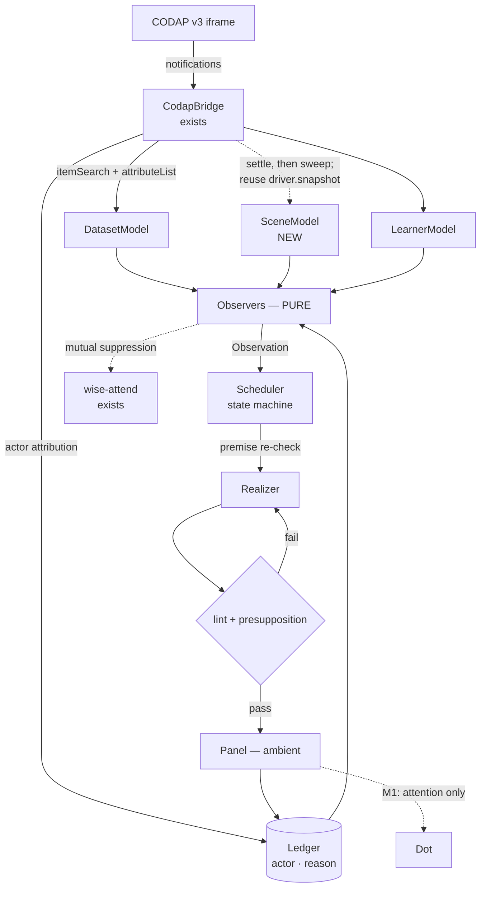

# feat: Wonderings — ambient inquiry prompts over a live CODAP document

## Overview

A toggleable panel anchored beside CODAP's Undo control shows a small number of
short, italic, rhetorical questions — *wonderings* — computed from the
student's actual dataset and current on-screen configuration. They fade in as
scenarios emerge and fade out when stale. They are ambient, attributed to no
one, so the axolotl character ("Dot") remains wordless and `docs/CHARACTER.md`
continues to hold. Dot may later draw attention to a wondering without
authoring it.

The origin design is `docs/WONDERINGS.md`. **This plan corrects fourteen of its
claims** — see [Corrections to the Origin Document](#corrections-to-the-origin-document).
Where the two differ, this plan wins on the corrected points and the origin
document wins on everything else.

## Problem Frame

CODAP gives students a powerful exploration surface and no prompt to explore
it. A student who has made one plot often does not know what the second
question is. The project already computes real structure in the dataset
(`web/src/insight.js`) and already models what the student has done
(`web/src/behavior-engine.js`), but that understanding is currently visible
only in a hidden developer panel and expressible only as the character's
wordless attention.

The opportunity is to surface it as genuine wonderings — open questions that
may not resolve — without becoming a tutor, without asserting findings, and
without suppressing the student's own question-asking.

## Requirements Trace

Derived from the feature brief (items a-h) and `docs/WONDERINGS.md`.

- **R1** *(brief a)* — Toggleable. Off must cost zero main-thread work.
- **R2** *(brief b)* — A panel anchored left of CODAP's Undo control, with a
  standing `Wonderings` label, supporting multiple lines.
- **R3** *(brief c)* — Brief rhetorical questions, italic, light font, fading in
  and out as scenarios emerge.
- **R4** *(brief d)* — Ambient ("from the sky"), never the character speaking.
  Dot may connect a wondering to a component through attention and, later,
  interaction.
- **R5** *(brief e)* — Computed in advance where possible; live model calls not
  ruled out, and treated as an opportunity to explore what AI offers inquiry.
- **R6** *(brief f)* — Tuned for voice and register; true wonderings that do not
  always prove true and need not have a correct answer.
- **R7** *(brief g)* — Responsive to what is on screen now, and eventually to the
  learner's history, in conjunction with what is known about the dataset.
- **R8** *(brief h)* — A scene model and a data/relationship model that are
  usable, extensible, and appropriate.

## Scope Boundaries

- **Not** a learner mastery or competence model.
- **Not** the character speaking, ever. No wondering text may reach `Axolotl.emote()`.
- **Not** injected into CODAP's DOM. Host-document overlay only.
- **Not** composing multiple observations into a narrative.
- **Not** a live model call before M3, and not then unless uptake data earns it.
- **Not** a new test framework — see [Key Technical Decisions](#key-technical-decisions).
- **Not** a fix for CODAP's own performance characteristics.

## Context & Research

### Relevant Code and Patterns

| Concern | Follow this | Note |
|---|---|---|
| Toolbar-anchored overlay | `web/src/ui/dot-badge.js` — selector cascade, `findHelp()`, `placeLeftOfHelp()`, corner fallback | **Do not copy wholesale**: no `destroy()`, leaks its resize listener, stops repositioning after 120 s |
| Undo anchor | `[data-testid="tool-shelf-button-undo"]` at `web/src/demo/resolvers.js:108`, `web/src/inject-test.js:196`, `web/src/inject-tests-suite.js:38`, `web/src/inject-unknowns.js:59` | P0-verified. It is on the **tool shelf**, not the menu bar |
| Iframe readiness | `codapDocReady(iframe)` — already exists; `sameOrigin()` is **not** a readiness check | `web/src/codap-main.js:200-218` records why |
| API call discipline | `DemoDriver.api()` at `web/src/demo/demo-driver.js:254-272` — reads 4× at 3 s, **writes never retried** at 6 s | `bridge.request()` has no timeout, no retry, never rejects |
| Concurrent snapshot | `DemoDriver.snapshot({maxAgeMs})` at `web/src/demo/demo-driver.js:304-338` | `CodapBridge.components()` does the same **serially** and is the slow path |
| Monotone healing | `BehaviorEngine._resyncComponents()` at `web/src/behavior-engine.js:396-410` | "never lower a count" — absence requires affirmative observation |
| Cancellation grace | `ACTION_GRACE_SEC = 0.35` at `web/src/behavior-engine.js:29` | The house answer to "the triggering gesture's own echo must not cancel what it triggered" |
| Pure analysis split | `web/src/insight.js` — async `analyzeDataset` → plain object → pure `suggestMoves` | The observer layer mirrors this shape |
| Truly pure module | `web/src/data-moves.js` — zero browser globals, node-importable today | The only precedent |
| Node-runnable fixture | `web/src/demo/fixture.js` — 12-row Mammals, zero browser deps | Verified importable 2026-08-28 |
| Behavior authoring (M1) | `docs/PLAYBOOK-behaviors.md` | One entry in `web/src/behaviors.js`, **no engine changes** |
| Overlay input discipline | `web/src/whisker.js` — inert on first `mouseenter`, re-arms 2.5 s later | M2's clickable wondering follows this |
| Module conventions | `web/src/codap-bridge.js`, `web/src/data-moves.js` headers | JSDoc header stating *why with dated evidence*; SCREAMING_SNAKE constants each carrying unit and rationale; named exports only |

### Institutional Learnings

Each has already cost this project time once.

- **Never cache `contentDocument`.** `about:blank` is same-origin and yields a
  live, permanently dead document (`docs/DRAG-GHOST-CONUNDRUM.md` §0).
- **Writes are never retried.** One `create` whose reply was dropped produced
  **four graphs** (`docs/verification/phase9/P2-NOTES.md` §2).
- **Reads are always retried.** iframe-phone replies are intermittently lost.
- **Some notifications do not exist.** No notification when a data context is
  created; `attributeChange` detection is intermittent
  (`docs/verification/phase9/BAILOUTS.md` #1, #2). A floor sweep is the
  *primary* channel for at least one event class.
- **No drag notifications for internal drags** (`docs/BEHAVIORS.md` footnote b).
- **Layout-forcing reads are the documented killer.** One
  `getBoundingClientRect()` per move turned a 3 s drag into 58 s
  (`docs/verification/phase9/P4-NOTES.md`).
- **Measurement hygiene.** Three leaked `agent-browser` processes confounded
  every timing in the project's history; idle worst gap 3861 ms → 720 ms after
  killing them. `ps -A | grep agent-browser` is step 0.
- **One or two runs is not evidence.** A drag documented as working landed 1-in-4
  when checked (`docs/DRAG-GHOST-CONUNDRUM.md` §5). The repo's bar is green three
  times consecutively.
- **Interleave arms, never block them.** Between-session variance measured at 13×.
- **Under-cheer, deliberately.** *"A missed cheer is invisible; a wrong cheer is
  noise"* (`docs/PHASE7.md`). What Dot never does: *explain, point at what to do
  next, or respond with anything that reads as grading* (`docs/DATA-MOVES.md` §3).
- **Making a graph is not a data move** — most Tier-A wonderings prompt plotting,
  which is a non-move.

### Measurements Taken For This Plan

Scripts in `docs/verification/wonderings/`; reproducible from disk.

1. **The correlation pairing bug is real.** Replicating `insight.js`'s exact
   arithmetic, a perfect relationship in 18 cases with 4 blank cells reads
   **r = 0.29**. (`corr-pairing-bug.mjs`)
2. **The three non-trivial observers are computable locally.** eta² separates a
   working legend (1.00) from a useless one (0.03); Simpson's paradox detected;
   curvature detected via the Spearman/Pearson gap. (`observation-feasibility.mjs`)
3. **The real shipping fixture breaks two design assumptions.** On the 12-row
   Mammals dataset, `Mammal` is an identifier (12 unique / 12 cases) scoring
   **eta² = 1.00 against every numeric attribute**; `Order` has 7 groups over 12
   cases scoring 0.69–0.97. Pearson systematically understates: Height × Mass
   r = 0.59 vs ρ = 0.81; Mass × Sleep −0.47 vs −0.79, because `Mass` spans 0.023
   to 6654 with one case at |z| = 3.08. The one genuinely good wondering is real:
   **Height × Sleep, r = −0.74**. (`against-real-fixture.mjs`)
4. **The lint works, with one blind spot.** All six intended-pass phrasings pass
   and all seven intended-fail ones fail — but *"Why do the colours mix
   together?"* passes while presupposing that they mix. (`lint-feasibility.mjs`)
5. **Significance floor.** At n = 12, |r| ≥ 0.576 clears p < .05 two-tailed.
   `insight.js`'s existing `STRONG_R = 0.5` is **below** that floor.

## Corrections to the Origin Document

Listed first because several change the MVP's shape.

**Evidence and policy**

1. **§4.2 risk 2's `[VERIFIED]` tag was unearned, and the claim is wrong.** The
   cited "26 fps idle, 3.8 fps mid-demo, gaps of 6-12 s" describes a measurement
   `docs/DRAG-GHOST-CONUNDRUM.md` §7 records as *"prepared and then abandoned"*,
   inside material later retracted. What survived says the opposite: *"An idle
   page is quiet. Three minutes with nothing dragged: zero frame gaps over 1 s,
   worst gap 894 ms. The stalls follow the press; they are not ambient."*
   (`docs/EXPERIMENT-RENDER-STARVATION.md` §3). The stall is CODAP's own React work.
2. **Therefore §8.4's poll policy is inverted.** Polling on `component:*`
   notifications aims new work at the measured-busiest window. Corrected: sweep
   during quiet, *defer* after a student action until settle.
3. **§8.4 also suspends on the wrong flag.** `driver.timelineActive` is true only
   while a path or drag is *sampling* (`web/src/demo/demo-driver.js:235`) — it is
   false during the API-heavy CSV import and during `revert()`. Use
   `driver.phase !== 'idle'` or an explicit running flag, and cover the whole run
   plus a settle after `revert()`.
4. **The SceneModel must reuse `driver.snapshot({maxAgeMs})` when a driver
   exists**, not run a second poller. The driver's own comment records that
   duplicate serial polling was *"the single biggest cost in a demo."*

**Observers and identity**

5. **`legend-separation` cannot ship as specified** — on the actual Mammals
   fixture it fires confidently and wrongly. Needs identifier exclusion
   (`cardinality === caseCount`), a group-count ceiling, and a minimum group size.
6. **Spearman moves M1 → M0.** Pearson mis-ranks the shipping dataset badly
   enough that an MVP ranking on it names the wrong pairs.
7. **`key` must be namespaced by data context now**, before the ledger exists —
   `second-dimension:Mammals:Sleep:Mass`. `insight.js:23-28` analyzes only the
   *first* populated context, and the demo itself imports a second dataset
   mid-session. Changing the key shape later invalidates every recorded measurement.
8. **The panel and `wise-attend` collide at M0, not M1.** `web/src/insight.js:120-127`
   already emits `rel:A:B` from exactly the correlations the Tier-A observers
   consume, and `web/src/behaviors.js:1160` already delivers them as Dot's
   attention. Today a student could get Dot's fascinated stare *and* an
   unrelated-looking italic line about the same relationship, with nothing
   connecting them.

**Metrics and lifecycle**

9. **M0 metric 4 fails on an untouched page.** `_resyncComponents` issues one
   `get component[id]` per component every 15 s regardless of any wondering code
   — four bursts inside the 60 s window. The metric must count *pipeline-originated*
   requests via a tagged wrapper.
10. **M0 metric 3's 10 s is unachievable.** A 2 s quiet gate plus a 10 s floor
    sweep gives ~12 s worst case. Either widen the metric or tighten the sweep,
    and show the arithmetic.
11. **The uptake metric cannot tell the student from the demo.**
    `web/src/behavior-engine.js:96` treats *every* CODAP message as student
    activity, and the demo driver acts through the same API. On the developer's
    machine — possibly the only place M0 runs — most plotting is done by the
    demo, so uptake would read strong from a script.
12. **§8.1's invalidation is exemplified, not defined.** One rule suffices, and
    observer purity makes it free: *re-run the originating observer against the
    current models; if it no longer emits an Observation with this key, the
    wondering is stale.*
13. **§8.1's 20 s floor and "fade out immediately when false" contradict** in
    exactly the ideal case — the student plots the named pair 3 s after it
    appears. Invalidation must outrank the floor.
14. **§6's Undo anchor is no longer `[UNVERIFIED]`**, and it is on the **tool
    shelf** — the row that also holds Graph, Table, Map and Slider. Every
    occlusion claim concerns an already-dense row. Worse, a fixed panel
    immediately left of Undo sits on the path Dot walks to tap Undo
    (`web/src/demo/demo-driver.js:801`, `:829`) **eight times per demo**.

Two holes, not corrections:

- **"Never fade in during a drag" is not implementable** from notifications
  (CODAP emits none for internal drags). Fold it into "student acted within 2 s."
- **The lint cannot catch presupposition.** A question asserting its own premise
  is an assertion in disguise.

## Key Technical Decisions

- **No test framework is introduced.** No runner, CI, or linter exists; `vitest`
  would be the repo's first devDependency ever. House precedent is
  dependency-free `.mjs` under `docs/verification/<topic>/`, run by `node <path>`;
  "exits non-zero" is satisfiable with `process.exit(1)`. *Rationale:* a toolchain
  is a larger, riskier change than the feature, and this precedent already
  produced the five measurements above.
- **Observers are a pure module with zero browser globals**, mirroring
  `web/src/data-moves.js`. *Rationale:* purity is what makes the corpus test
  possible without a browser, and it makes the staleness rule (correction 12) free.
- **All CODAP reads go through `DemoDriver.api()`'s discipline**, and the
  SceneModel reuses the driver's cached concurrent snapshot when one exists.
- **The toggle gets its own lever, separate from `engine.enabled`.** *Rationale:*
  `behavior-engine.js:115-116` deliberately resyncs even when behaviors are
  disabled, so a flag-only toggle would not stop what R1 requires stopped.
- **`Observation` is the contract; realization may not introduce a claim.**
- **Every ledger entry carries an actor and a reason.** *Rationale:* correction 11.
  Without actor attribution the headline metric is measuring the demo; without a
  fade reason, "acted on" cannot be distinguished from "undone."
- **Absence requires affirmative observation.** A premise may be judged false only
  from a *successful* poll, never from a dropped reply — the `_resyncComponents`
  rule generalized.
- **One keyed affordance set feeds both `suggestMoves` and the observers**, with
  mutual suppression. *Rationale:* correction 8; two rankers guarantee divergent
  pedagogy.
- **Wonderings are ambient and unattributed.** `docs/CHARACTER.md:13` and `:43`
  are binding, and ambient authorship is independently better — an unacted
  wondering is not a social failure the way an ignored character would be.

## Open Questions

### Resolved During Planning

- *Which selector anchors the panel?* `[data-testid="tool-shelf-button-undo"]`,
  P0-verified in four call sites. Text selectors are last-resort — CODAP's labels
  contain lookalike Unicode ("Νew" begins with Greek Nu).
- *Does a test runner need introducing?* No.
- *Is the fixture available offline?* Yes — `web/src/demo/fixture.js`.
- *Where does developer-facing provenance render?* The existing "Dot's mind"
  panel, not a new surface.
- *Can the SceneModel be notification-driven?* No — `component:attributeChange`
  carries no attribute name (`web/src/codap-bridge.js:69`).
- *How is staleness defined?* Re-run the observer; no matching key means stale.

### Deferred to Implementation

- Exact fade timings, minimum display, and budget constants. The origin's 20 s /
  3 min / 90 s are guesses of the same kind as `wise-attend`'s 240 s, which
  `docs/PHASE8-POC.md` itself labels "a guess." Label them as guesses; tune from
  observed sessions on the shipping profile only.
- `attributeList`'s real response shape and cost — zero call sites exist in
  `web/src`, so this is genuinely unexercised territory.
- The presupposition guard's mechanism (likely structural, not lexical).
- Whether `we`/`us` are teacher register or co-investigator voice. What makes a
  question a teacher's is *assessment*, not the pronoun.
- Narrow-viewport thresholds. M0's cap of 1 line is already the fallback state,
  which means **M0 cannot discover this problem and M1's raise to 3 will meet it
  cold** — state that in M1 rather than letting it surprise.
- Evidence scoping against `hiddenCases` / `displayOnlySelectedCases`. A
  correlation over all cases while the graph shows 12 unhidden ones is "wrong but
  loud" in a form the `n` gate does not catch.

### Blocking — Owner's Call, Not the Implementer's

- **Does M0 ship to classrooms at all**, given that the origin's §13.2 (supplying
  questions may suppress students' own question-asking) is unmitigated and not
  measurable by uptake? External pedagogical research was commissioned for this
  plan; see [Risks](#risks--dependencies).
- **Default toggle state for M0.** The origin says *off*; but M1 and M3 are gated
  on uptake data, and a default-off feature with no discovery affordance yields
  approximately zero sessions of it. Either default on (with the cap of 1 as the
  safety) or state how the data will otherwise be collected.
- **Does an undone uptake still count?** Undo is frequent — every demo ends with
  up to eight of them.
- **What is N in "within N minutes"?** Currently undefined, so the metric is not
  implementable.
- Any amendment to `docs/CHARACTER.md`; any decision to send data to a
  third-party API from a classroom.

## High-Level Technical Design

> *This illustrates the intended approach and is directional guidance for review,
> not implementation specification. The implementing agent should treat it as
> context, not code to reproduce.*



The wondering lifecycle, which replaces §8.1's list of rules:

```
absent → pending → fading-in → visible → fading-out → retired
                                   ↑ premise re-checked before fade-in starts
every transition records a reason:
  stale | taken-up | timeout | toggled-off | scene-gone | document-changed
```

The contract that makes the rest testable:

```
Observation {
  type        'second-dimension' | 'unplotted-partner' | 'legend-separation' | ...
  key         'type:dataContext:attrA:attrB'   <- namespaced; ledger identity
  dataContext which dataset this is about
  focus       [attribute names]                <- realization may name ONLY these
  evidence    { r, rho, n, eta2, groups }      <- summary statistics ONLY
  strength    0..1        novelty  0..1
  scope       { componentId, sceneVersion }
  openness    'open' | 'checkable'
}
```

## Implementation Units

### Phase M0 — MVP: one wondering, no history, no model

- [ ] **Unit 1: Panel shell — anchor, four states, toggle**

**Goal:** A `Wonderings` panel that anchors correctly beside Undo on the tool
shelf, survives a class period, never intercepts a click, has defined empty
states, and whose toggle genuinely stops all work.

**Requirements:** R1, R2, R3

**Dependencies:** None. First deliberately — it resolves the tool-shelf question
and the anchor-durability question before anything depends on them.

**Files:**
- Create: `web/src/ui/wonderings-panel.js`
- Modify: `web/src/codap-main.js` (mount + toggle), `web/codap-same.html` (toggle control)
- Test: `docs/verification/wonderings/panel-anchor.md` (recorded manual protocol + screenshots; not node-testable)

**Approach:**
- **Four named states**, each with defined DOM and announcements: `off`, `idle`
  (on, nothing to say), `thinking` (analysis in flight), `showing`. The standing
  `Wonderings` label persists whenever the toggle is on, so the affordance is
  discoverable and a correctly-empty panel is distinguishable from a broken one.
  `thinking` is visually identical to `idle` — a spinner in a "quiet as weather"
  panel is an alert.
- Follow `dot-badge.js`'s cascade and fallback, but **fix its three defects**:
  return a `destroy()`, remove the resize listener on teardown, and replace the
  120 s settle-then-stop with a policy that survives a 45-minute session. Prefer
  `ResizeObserver`/`MutationObserver` on the tool shelf over an expiring timer;
  re-anchor on every `connected`.
- Do not mount until `codapDocReady(iframe)` passes. Read `contentDocument` fresh
  at every measurement; never hold a reference.
- `pointer-events: none` in M0, stated in CSS. **The panel must not overlap the
  Undo/Redo rects at any width** — Dot walks to and taps Undo eight times per demo.
- Anchor failure must be logged and detectable, never a silent corner fallback.
- Do not copy the dashboard's unconditional `setInterval(…, 500)`, which computes
  whether or not the panel is visible.
- `aria`: standing label **outside** the live region; `aria-live="polite"`
  with `aria-atomic="false"` and `aria-relevant="additions"`; one child per
  wondering with a stable key so only additions announce; at most one addition per
  tick; fade-out is not announced.

**Patterns to follow:** `web/src/ui/dot-badge.js`; `web/codap-same.html:6-36`
(z-index ladder: stage 50, panel 100, badge 120).

**Test scenarios:**
- *Happy path:* panel's left edge within 4 px of Undo's left edge, on **three
  consecutive page loads**.
- *Happy path:* each of the four states renders its defined DOM; `idle` shows the
  label and no wondering.
- *Happy path:* toggling off removes the panel; toggling on at minute 5+
  re-anchors correctly (the defect that kills a copied `installDashboardBadge`).
- *Edge case:* CODAP not yet loaded — panel does not mount; logs.
- *Edge case:* welcome banner visible vs dismissed (~44 px shift) — anchor holds.
- *Edge case:* 1024 px and 768 px widths — record actual behavior; panel degrades
  before overlapping Undo/Redo.
- *Error path:* `data-testid` returns nothing (simulating a version bump) —
  corner fallback, logged, no exception.
- *Integration:* a click aimed at Undo passes through the panel region and Undo fires.
- *Integration:* a full `tutorial2` demo run completes with the panel mounted —
  all eight of Dot's Undo taps land.

**Verification:** Panel visible beside Undo, toggle honored, `ps -A | grep
agent-browser` clean when position was measured.

---

- [ ] **Unit 2: SceneModel**

**Goal:** A live, cheap, honest model of what is on screen that never mistakes a
dropped reply for a student action.

**Requirements:** R7, R8

**Dependencies:** Unit 1.

**Files:**
- Create: `web/src/scene-model.js`
- Modify: `web/src/codap-bridge.js` (stop discarding component fields / expose the concurrent snapshot for reuse)
- Test: `docs/verification/wonderings/scene-model.mjs` (asserts derived shape from a recorded payload; no browser)

**Approach:**
- **Reuse `driver.snapshot({maxAgeMs})` when a driver exists.** Otherwise use the
  same concurrent `Promise.all` fan-out — never the serial `CodapBridge.components()`.
- All reads through `DemoDriver.api()`'s discipline. Tag every request so Unit 7's
  metric can count pipeline-originated traffic separately from the engine's own
  15 s resync.
- **Corrected poll policy:** wall-clock floor sweep during quiet; after a
  `component:*` notification, wait for settle before reading. Never per-rAF.
- **Suspend for the whole demo**, keyed on a real condition (`driver.phase !==
  'idle'` or an explicit running flag), plus a settle period after `revert()`.
- Heal monotonically. Carry a `sceneVersion` that increments on every successful
  poll, and a per-component staleness flag.
- Derived: `plottedAttrs`, `unplottedAttrs`, `attrPairsPlotted`, `focusComponent`
  (documenting that `lastInteractionAt` is set only by move/resize/slider/
  attributeChange, not by selection or plain clicks — so focus is approximate).
- Instrument so failure modes are **discriminable** from the console: "reply lost"
  must not look like "nothing qualified."

**Patterns to follow:** `web/src/behavior-engine.js:396-410`;
`web/src/demo/demo-driver.js:304-338`, `:254-272`.

**Test scenarios:**
- *Happy path:* a graph with x=Age, y=Height, legend=Sex yields all three.
- *Edge case:* univariate graph — `y` is null, not absent.
- *Edge case:* two graphs on different data contexts — each carries its context.
- *Error path:* dropped reply for one of three components — that one keeps its
  last state and is flagged stale; the others update; **nothing is reported as removed**.
- *Error path:* `bridge.request` never resolves — the timeout fires, the sweep completes.
- *Integration:* during a `tutorial2` demo run the SceneModel issues zero requests
  of its own.
- *Integration:* toggle off ⇒ zero **pipeline-tagged** `component[id]` requests
  over 60 s, while the engine's own resync continues untouched.

---

- [ ] **Unit 3: DatasetModel — fix the correlation, add what the observers need**

**Goal:** Trustworthy relationship statistics. Without this every wondering is
built on sand.

**Requirements:** R7, R8

**Dependencies:** None (pure). Parallelizable with Units 1-2.

**Files:**
- Create: `web/src/dataset-model.js` (pure; zero browser globals)
- Modify: `web/src/insight.js` (use the pure module; fix the pairing bug; raise `STRONG_R` above the n-floor; distinguish *no context* from *context too small*)
- Test: `docs/verification/wonderings/dataset-model.mjs`

**Approach:**
- **Pairwise-complete Pearson** — the blocking fix. Reference implementation
  exists as `corr()` in `observation-feasibility.mjs`.
- **Spearman in M0** (correction 6).
- Retain `n` per pair; gate on the significance floor (|r| ≥ 0.576 at n = 12).
- **Attribute role inference promoted to M0**: `cardinality === caseCount` ⇒
  identifier, excluded from every observer. This is what stops `Mammal` scoring
  eta² = 1.00 against everything.
- eta² with a group-count ceiling and minimum group size.
- Analyze **per data context**, not just the first populated one.
- Fix `Object.keys(rows[0])`; resolve or delete `hasFormulas`.
- Fetch `attributeList` for declared type/unit/description; record the response
  shape in a verification table, per the P0 convention.

**Execution note:** Test-first. The regression fixture and its expected value
(r = 1.00, currently 0.29) already exist; write the assertion before the fix.

**Test scenarios:**
- *Happy path:* Mammals yields Height × Sleep as top-ranked (r = −0.74).
- *Happy path:* eta² separates a working legend (1.00) from a useless one (0.03).
- *Edge case — the regression:* 18 cases, 4 blanks, true r = 1.00 → returns
  **1.00**, not 0.29. Exit non-zero otherwise.
- *Edge case:* `Mammal` classified identifier; produces **no** observation of any type.
- *Edge case:* `Order` (7 groups / 12 cases, smallest 1) suppressed by the ceiling.
- *Edge case:* fewer than 4 cases → a *distinct* result from "no context at all".
- *Edge case:* an attribute missing from the first case is still analyzed.
- *Error path:* an all-blank numeric column does not divide by zero.
- *Error path:* `attributeList` unavailable — fall back to inference, do not throw.

**Verification:** `node docs/verification/wonderings/dataset-model.mjs` exits 0.

---

- [ ] **Unit 4: Observers, Observation identity, and the `wise-attend` resolution**

**Goal:** Three Tier-A observers emitting typed, context-namespaced
`Observation`s, with the overlap against the existing insight machinery resolved
rather than left to drift.

**Requirements:** R6, R7

**Dependencies:** Units 2, 3.

**Files:**
- Create: `web/src/wonderings/observers.js` (pure)
- Modify: `web/src/insight.js` and/or `web/src/behaviors.js` for the shared affordance set
- Test: `docs/verification/wonderings/observers.mjs`

**Approach:**
- Pure `(dataset, scene, learner) → Observation[]`. No I/O, no clock, no randomness.
- Three: `second-dimension`, `unplotted-partner`, `legend-separation` (the last
  only after Unit 3's guards exist).
- **`key` namespaced by data context** from the first commit. An observation is
  eligible only while a component bound to that context is on screen.
- **Resolve `wise-attend`.** One keyed affordance set feeds both it and the
  observers; a key shown in the panel suppresses `wise-attend` on that key for a
  stated interval and vice versa; M0 states which wins on a tie. Retiring or
  re-pointing `wise-attend` is acceptable; two independent rankers is not.

**Patterns to follow:** `web/src/data-moves.js` (purity, closed-table matching,
under-cheering disposition); `web/src/insight.js:95-150`.

**Test scenarios:**
- *Happy path:* Mammals + univariate Sleep → `second-dimension` naming Height.
- *Happy path:* legend on a 3-group separating attribute → the "stacks" branch.
- *Edge case — regression:* legend = `Mammal` → **no observation**; legend =
  `Order` → **no observation**.
- *Edge case:* a pair already in `attrPairsPlotted` scores novelty 0.
- *Edge case:* two data contexts loaded — keys do not collide, and an observation
  for an offscreen context is not emitted.
- *Edge case:* no graph at all → empty array.
- *Integration:* the same key never yields two ledger entries in one session.
- *Integration:* a key surfaced in the panel suppresses `wise-attend` on that key.

---

- [ ] **Unit 5: Ledger, actor attribution, and the uptake metric**

**Goal:** Make uptake measurable *and honest* — which means knowing whether the
student or the demo did the thing.

**Requirements:** R7

**Dependencies:** Unit 4.

**Files:**
- Create: `web/src/wonderings/ledger.js`
- Modify: `web/src/codap-bridge.js` (tag notifications arriving during a demo run)
- Test: `docs/verification/wonderings/ledger.mjs`

**Approach:**
- Every entry carries `actor: 'student' | 'demo' | 'unknown'`. The bridge tags
  notifications arriving while a demo is running; demo-attributed uptake is
  counted separately and **excluded from the headline number**. Without this the
  metric measures the script (correction 11).
- Every entry carries `shownAt`, `fadedAt` **with a reason** (`stale | taken-up |
  timeout | toggled-off | scene-gone | document-changed`), and `revertedAt` when
  an uptake is undone inside the window.
- **A wondering whose uptake is unobservable is recorded as `unmeasurable`,
  never as not-taken-up** — the `HideUnselected` residue-0 lesson, where a revert
  reported clean while leaving 74 cases hidden.
- Record whether the named pair was already in `attrPairsPlotted` at `shownAt` —
  that disqualifies the *wondering*, not the uptake.
- Uptake predicate: exact unordered-pair match; near-misses logged separately (a
  loose predicate makes the metric un-falsifiable). At most one wondering credited
  per action; credit the most recently shown match.
- Detection resolution is the sweep interval — a pair plotted and removed inside
  one sweep is invisible. State this as a known limit of the metric.
- When nothing was shown, record *why*: "no observation qualified" must be
  distinguishable from "the poll failed."

**Test scenarios:**
- *Happy path:* a wondering named Sleep×Mass, then the student plots Sleep×Mass →
  one `taken-up` entry, actor `student`.
- *Edge case — the regression:* a scripted `tutorial2` run start-to-finish
  produces **zero student-attributed uptake events**.
- *Edge case:* uptake then undo inside the window → `revertedAt` recorded.
- *Edge case:* pair already plotted before `shownAt` → the wondering is
  disqualified, not credited.
- *Edge case:* two faded-but-in-window wonderings could claim one action → exactly
  one credited.
- *Error path:* the SceneModel cannot observe the pair → `unmeasurable`, not
  `not-taken-up`.

---

- [ ] **Unit 6: Scheduler state machine, realizer, lint, corpus**

**Goal:** Turn Observations into at most one visible wondering, in the right
register, at a moment that does not interrupt — with a lifecycle that is a state
machine rather than a list of rules.

**Requirements:** R3, R5, R6

**Dependencies:** Units 4, 5, 1.

**Files:**
- Create: `web/src/wonderings/scheduler.js`, `web/src/wonderings/realize.js`, `web/src/wonderings/lint.js`
- Test: `docs/verification/wonderings/lint.mjs`, `docs/verification/wonderings/corpus.mjs`

**Approach:**
- **State machine**: `absent → pending → fading-in → visible → fading-out →
  retired`, each transition recording a ledger reason.
- **Premise re-check immediately before fade-in** against the current
  `sceneVersion`; discard silently if it no longer holds. A premise may be judged
  false only from a *successful* poll.
- **Invalidation outranks the 20 s floor** (correction 13). The floor exists to
  stop scheduler churn, not to hold a stale line on screen.
- A fade-in is never cancelled once started; `shownAt` stamps at fade-in *start*;
  the quiet gate is a precondition only. Precedent: `ACTION_GRACE_SEC`.
- A wondering stays creditable until `fadedAt` + grace, with the window running
  from `shownAt` — otherwise a wondering that timed out can never be credited and
  the wallpaper detector partly measures its own timeout.
- **Retired keys re-arm on a stated cooldown or never in-session** — undo restores
  the very scene that produced the observation, so without this every demo's
  eight undos re-arm what they just retired.
- Template realizer, several phrasings per type selected by a hash of `key`, so
  the same observation always reads the same way.
- Lint gates **every** realization. Promote the working prototype; **add a
  presupposition guard**; settle the `we`/`us` question.
- Timers ride `performance.now()` deltas, never accumulated frame `dt`.
- **Drop the "not during a drag" rule**; fold into "student acted within 2 s."
- Budget starts at 1 visible; constants labelled as guesses.
- Corpus enumerates `(fixture × scene configuration)` and emits every
  `(state → observation → wondering)` triple to one reviewable file.

**Test scenarios:**
- *Happy path:* six intended-pass phrasings pass; seven intended-fail ones fail
  with the right violation named.
- *Happy path:* corpus emits ≥ 40 triples, 100% lint-clean; exits non-zero otherwise.
- *Edge case — known blind spot:* "Why do the colours mix together?" is
  **rejected** once the presupposition guard exists.
- *Edge case:* 70 characters passes, 71 fails.
- *Edge case:* student plots the named pair 3 s after fade-in → fades out
  immediately; the 20 s floor does not hold it.
- *Edge case:* the graph is deleted during `fading-in` → completes the fade-in,
  then retires with reason `scene-gone`.
- *Edge case:* premise false at re-check → never displayed, no ledger `shownAt`.
- *Edge case:* the same observation realized twice yields identical text.
- *Error path:* `focus` names an attribute absent from the template's slots →
  no text rather than a malformed sentence.
- *Integration:* budget 1 with two qualifying observations → one shown, the other
  deferred rather than dropped silently.

---

- [ ] **Unit 7: Wire together, instrument, measure**

**Goal:** The end-to-end MVP against a live CODAP, with provenance visible to
developers and an honest thread-cost measurement.

**Requirements:** R1-R7

**Dependencies:** Units 1-6.

**Files:**
- Modify: `web/src/codap-main.js` (mount pipeline; render provenance into the existing mind panel)
- Test: `docs/verification/wonderings/live-session.md` (recorded protocol + screenshots)

**Approach:**
- Provenance renders into the **existing** "Dot's mind" panel, not a new surface.
- Document-level reset: on `documentChangeNotice` or a wholesale change in
  `dataContextList`, clear both models, fade all visible wonderings with reason
  `document-changed`, and key the ledger by document. **M0 uptake is
  per-page-load** — state it, and size N against it.
- Measurement protocol: `ps -A | grep agent-browser` first; toggle on/off
  **alternating within one page session**, ≥ 3 reps per arm; report worst gap and
  count of gaps > 1 s, never average fps; treat absolute milliseconds as
  non-transferable across sessions or profiles.

**Test scenarios:**
- *Happy path:* live Mammals session — a univariate Sleep plot produces one
  wondering within the corrected latency budget, on **three consecutive runs**.
- *Edge case:* the referenced graph is deleted → fades with reason `scene-gone`.
- *Edge case:* the student undoes the triggering action → fades; the key does not
  immediately re-arm.
- *Edge case:* File ▸ Open swaps the document in place → both models cleared.
- *Edge case:* second dataset imported mid-session → keys do not collide.
- *Edge case:* page reload → ledger resets (assert this is what happens rather
  than assuming).
- *Error path:* CODAP disconnects → panel returns to `idle`, no console exceptions.
- *Integration:* toggle-on vs toggle-off frame-gap comparison, arms interleaved,
  shows no material regression.
- *Integration:* a full demo run produces zero student-attributed uptake.

### Phase M1 — History, richer observers, Dot's attention

Tier-B observers (`reversal`, `curvature`, `outlier-in-view`,
`untouched-attribute`, `spread-contrast`, `crowded-axis`); `attrsEverPlotted` /
pair novelty; `sessionStorage` ledger; visible cap raised to 3 **only if** M0
uptake supports it — and note that raising to 3 meets the narrow-viewport ladder
cold, because M0's cap of 1 is already the fallback state.

Dot's attention behaviour is **one entry in `web/src/behaviors.js` with no engine
changes** (`docs/PLAYBOOK-behaviors.md` binding), in the ambient/low-reaction
priority band (`wise-attend` at 24 is the reference). Three conflict cases the
engine will not resolve, which the unit must:

- `_evaluate` refuses to fire anything while `actor.oneShot || actor.motion` is
  set externally — attention may simply never fire, and the panel cannot tell.
- A tick-triggered behavior has `graceUntil = startedAt`, so *any* notification
  cancels it immediately — including background `cases:change` traffic.
- If the wondering fades mid-walk there is no cancel path. The panel must expose
  `wonderingVisible(id)`; the behavior polls it via `ctx.waitFor` and returns
  cleanly; the scheduler does not fade a wondering that is the active attention
  target; attention only *starts* with a stated minimum display remaining, so Dot
  never arrives at an empty panel.

Verification follows the playbook's six steps, including `__engine.selfTest()`
staying green and the cancel check within ~1 s.

### Phase M2 — Interaction and model-authored phrasing

Clicking a wondering highlights its component and attributes — the first unit
that issues **writes**, so the never-retry rule becomes live. Follows the
whisker's one-enter-then-inert contract. Model-authored phrasings generated
offline across the corpus and shipped frozen. Tier-C semantic observers using
`description` and `unit`. Resolve `focusComponent`'s approximation, which matters
for click-to-highlight.

### Phase M3 — Live model calls

Gated on uptake showing M2 wonderings are acted on measurably more often than
M0's. If template wonderings are already ignored, better wording is not the
problem. Constraints per origin §7.4, all testable: Observation-only input,
lint-gated output, attributes restricted to `focus`, timeout with template fallback.

## System-Wide Impact

- **Interaction graph:** `CodapBridge` gains consumers and an actor-tagging
  responsibility; `behavior-engine`'s `state` gains a derived field via the
  established bare-assignment seam; M1 adds one behavior to a 28-entry table
  where **one intervention runs at a time**, competing with existing nudges.
- **Error propagation:** every CODAP read can silently never resolve. Failures
  surface as a *reason in the ledger*, never as absence. The engine's precedent
  is to emote `?` rather than return silently.
- **State lifecycle risks:** dropped notifications leave the model blind unless
  healed; cached geometry goes stale when a reply is lost; in-place document
  switches emit no document-level event the bridge currently maps.
- **API surface parity:** none added. A `__dotWonder` debug global follows the
  `window.__` convention.
- **Integration coverage:** the corpus test is necessary and not sufficient.
  `docs/verification/phase9/P3-NOTES.md` records three races invisible until
  something real drove the code — *"which the automated checks had missed
  precisely because they drove the path that was covered."* Every unit keeps a
  live watch-it-run step.

## Risks & Dependencies

| Risk | Mitigation |
|---|---|
| **Supplying questions suppresses students' own question-asking** | Unmitigated by anything in this design and not measurable by uptake — high uptake could be evidence *for* it. Needs classroom observation. **Owner's call, blocking.** |
| **Uptake measures the demo, not the student** | Actor attribution in Unit 5, with a regression asserting a scripted run yields zero student-attributed uptake. |
| Wonderings become wallpaper | Cap of 1, no repeats, fade-out with reasons. Detected by uptake trending to zero — which requires the metric to be honest first. |
| `legend-separation` fires wrongly on the shipping dataset | Identifier exclusion + group-count ceiling + minimum group size, all in Unit 3, all with regression fixtures. |
| Spurious relationships at n = 12 | Significance floor (|r| ≥ 0.576); Spearman alongside Pearson; the wondering register makes being wrong survivable. |
| Panel occludes or intercepts Undo | `pointer-events: none`; must not overlap Undo/Redo at any width; a full demo run with eight Undo taps is an integration test. |
| Thread cost | Corrected poll policy; reuse the driver's snapshot; no per-rAF work; no cross-iframe rect reads on a timer during demos. Measured with interleaved arms after a process check. |
| Anchor breaks on a CODAP version bump | `data-testid` drifts silently. Failure logged and detectable. Production wants a pinned CODAP build. |
| Double-firing with `wise-attend` | Resolved in Unit 4 — shared affordance set with mutual suppression. |
| Dropped replies misread as student actions | Monotone healing; absence requires affirmative observation. |
| M2's writes duplicating components | Writes never retried; verify with a follow-up read. One dropped reply once produced four graphs. |

**Dependencies:** none external. No new packages. CODAP v3.1.0 build 2985 is the
verified target; `attributeList`'s response shape is the one genuine unknown.

## Documentation / Operational Notes

- Per the project's own `P#-NOTES` convention, leave `docs/WONDERINGS.md`
  **unedited** and let the corrections live here with the measurement that forced
  each one. Add a header to the origin pointing at this plan.
- Record `attributeList`'s response shape in a verification table when first observed.
- Every constant carries its unit and rationale in a trailing comment.
- The corpus file is the review artifact to circulate — not the code.

## Sources & References

- **Origin document:** `docs/WONDERINGS.md`
- Character doctrine (binding): `docs/CHARACTER.md:13`, `:43-58`
- Behavior authoring contract: `docs/PLAYBOOK-behaviors.md`
- Interaction stack: `docs/DOT-INTERACTION-STACK.md`
- Retraction and what survived: `docs/EXPERIMENT-RENDER-STARVATION.md` §0, §2c, §3
- Sampling-error lesson: `docs/DRAG-GHOST-CONUNDRUM.md` §5
- Write-retry lesson: `docs/verification/phase9/P2-NOTES.md` §2
- Missing notifications: `docs/verification/phase9/BAILOUTS.md` #1, #2
- Race conditions invisible to automated checks: `docs/verification/phase9/P3-NOTES.md`
- Under-cheer rule: `docs/PHASE7.md`, `docs/DATA-MOVES.md` §3
- Measurements for this plan: `docs/verification/wonderings/*.mjs`
